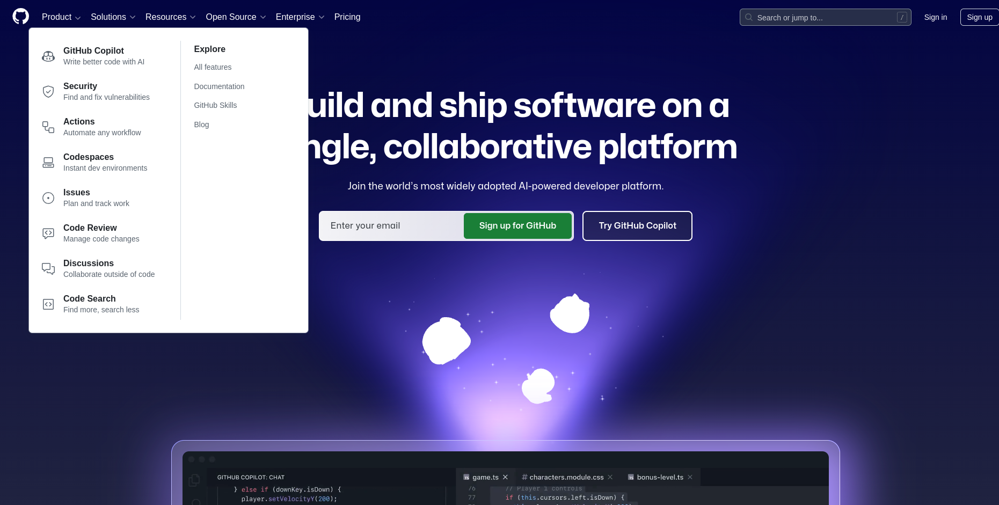
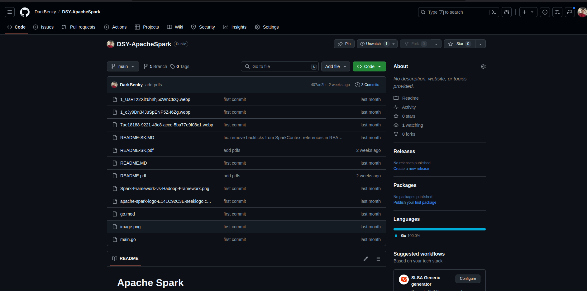

# Portfolio / Website Builder

Tento projekt si kladie za cieľ vytvoriť platformu, kde používatelia môžu vytvárať statické webstránky výberom z knižnice rôznych blokov. Používatelia budú môcť:

- Vybrať si rôzne štýly pre svoju stránku.
- Publikovať stránku online, aby bola viditeľná na webe.
- Exportovať stránku ako PDF.

## Referencie (Inšpirácia pre projekt)

- [GitConnected](https://gitconnected.com/)
- [Markdown to HTML](https://markdowntohtml.com/)

## Dizajn

Platforma bude mať modulárny dizajn s rôznymi témami pre stránky používateľov. Hlavná inšpirácia dizajnu bude pochádzať z:

- [GitHub](https://github.com/)
  - 
  - 
  - 

- [MUI Blog](https://mui.com/blog/)
  - 
  - 
