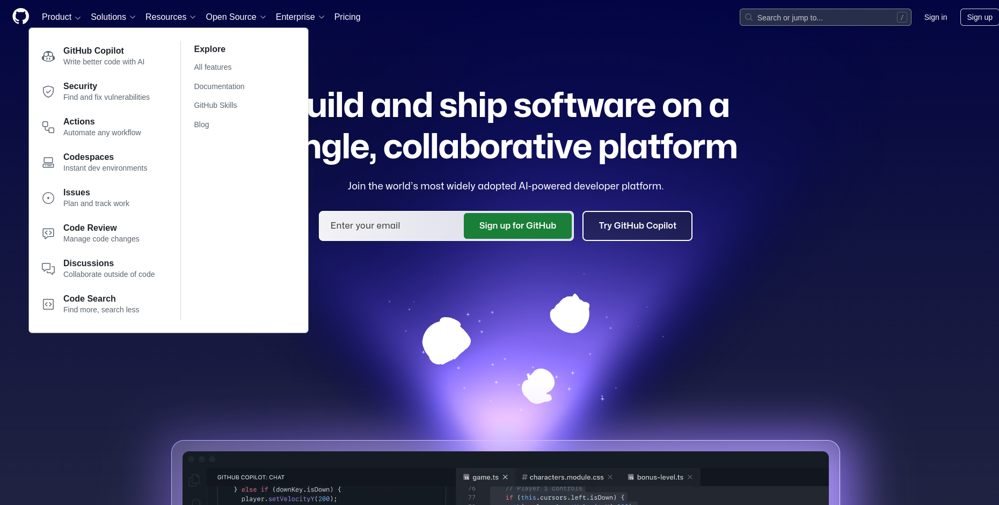
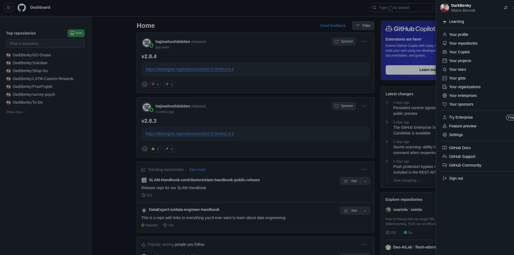
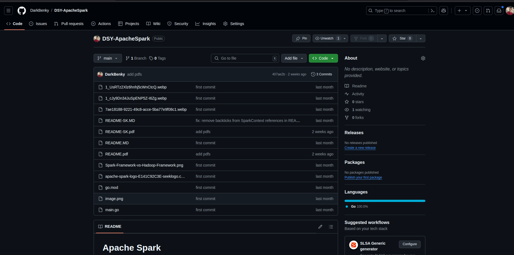
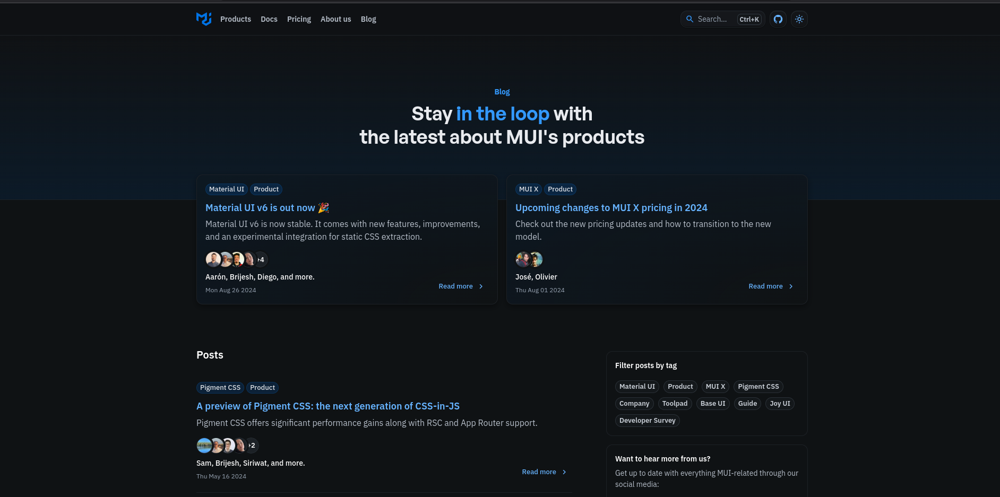
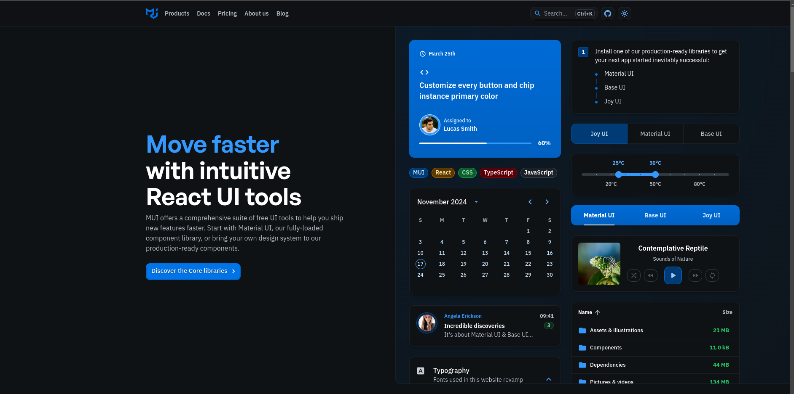

# Portfolio / Website Builder

This project aims to create a platform where users can build static websites by selecting from a library of different blocks. Users will be able to:

- Choose various styles for their site.
- Serve the site online to make it visible on the web.
- Export the site as a PDF.

## References (Inspiration for the Project)

- [GitConnected](https://gitconnected.com/)
- [Markdown to HTML](https://markdowntohtml.com/)

## Design

The platform will feature a modular design with different themes for users' sites. The primary design inspiration will come from:

- [GitHub](https://github.com/)
  - 
  - 
  - 

- [MUI Blog](https://mui.com/blog/)
  - 
  - 
